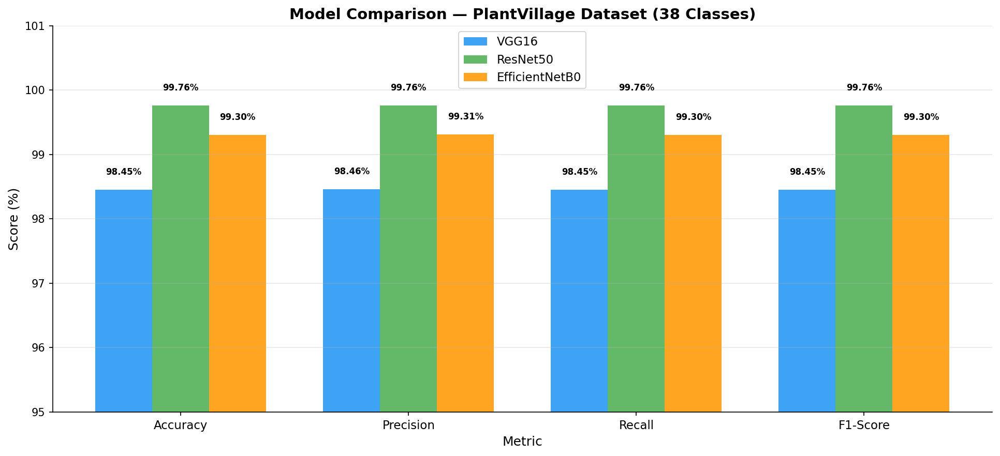
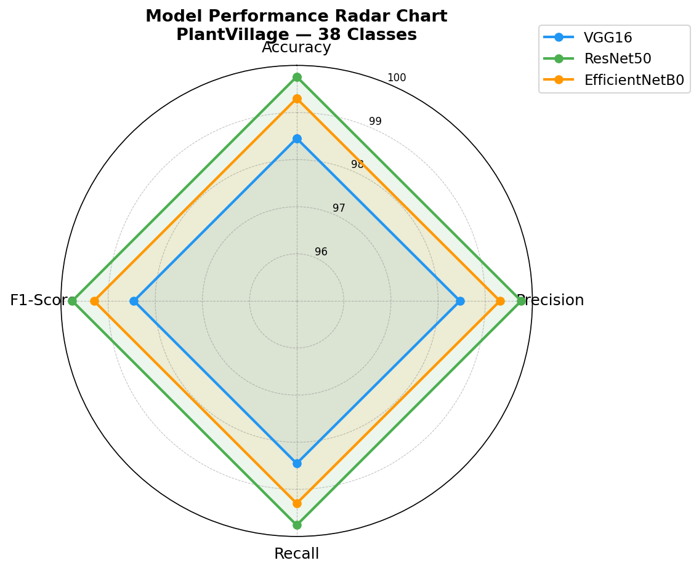
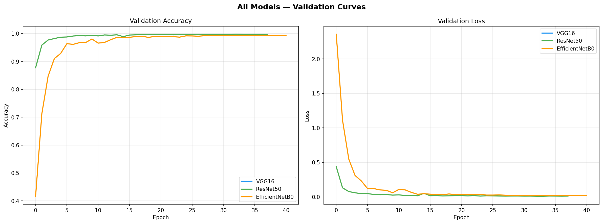

# Plant Disease Detection via Transfer Learning: Architecture Comparison on PlantVillage

[](https://www.python.org/)
[](https://www.tensorflow.org/)
[](https://doi.org/10.48175/IJARSCT-9156)
[](LICENSE)

> **Extends published research:** "Plant Disease Detection using Machine Learning"
> IJARSCT Vol. 3, Issue 2 & 4, April 2023 -- DOI: [10.48175/IJARSCT-9156](https://doi.org/10.48175/IJARSCT-9156)

---

## Motivation

Plant diseases cause an estimated 20--40% of global crop yield loss annually. Early and accurate detection is critical, but manual identification by agronomists is expensive and does not scale to the needs of smallholder farmers across rural regions.

Our previously published work established a CNN baseline for plant disease classification on the PlantVillage dataset. That study raised a question this project addresses directly: **does the choice of pretrained backbone fundamentally change what the model learns, or do architectures converge to equivalent solutions given sufficient data and fine-tuning?**

This is not merely a practical question. Transfer learning assumes that features learned on ImageNet -- edges, textures, object parts -- transfer to agricultural imagery. But the degree of this transfer depends on the inductive biases of each architecture. VGG16's uniform convolutional stack, ResNet50's residual connections, and EfficientNetB0's compound scaling each impose different assumptions about how features should be composed. Comparing them empirically on a controlled benchmark reveals how these assumptions interact with the structure of plant pathology imagery.

A critical technical challenge emerged during experimentation: BatchNormalization layers inside frozen backbones (ResNet50, EfficientNetB0) cause feature map corruption when the base model is frozen during fine-tuning. This is rarely discussed in transfer learning tutorials but has a dramatic effect on accuracy -- the difference between ~14% (random-level) and ~99% validation accuracy. Understanding and resolving this failure mode is one of the key contributions of this study.

---

## Research Questions

1. **Architecture vs. fine-tuning strategy** -- Does backbone choice (VGG16, ResNet50, EfficientNetB0) dominate performance, or does fine-tuning depth and learning rate schedule matter more?

2. **BatchNormalization and frozen layers** -- Why does freezing the base model cause catastrophic accuracy degradation in ResNet50 and EfficientNetB0 but not VGG16, and how should this inform fine-tuning practice?

3. **Efficiency-accuracy tradeoff** -- EfficientNetB0 has 26x fewer parameters than VGG16. Does the accuracy difference justify VGG16's parameter cost, or does compound scaling provide a better inductive bias for this domain?

4. **Generalization across 38 classes** -- How do per-class confusion patterns differ across architectures, and which disease categories remain systematically difficult regardless of backbone?

---

## Methodology

### Dataset

**PlantVillage** -- 54,305 images across 38 plant disease classes (14 crop species).

| Split | Images |
|---|---|
| Train | 43,456 |
| Validation | 10,849 |

### Models

All three backbones initialized with ImageNet weights. A custom classification head (GlobalAveragePooling + Dense + Dropout) is added on top.

| Model | Parameters | ImageNet Top-1 |
|---|---|---|
| VGG16 | 138M | 71.3% |
| ResNet50 | 25M | 76.0% |
| EfficientNetB0 | 5.3M | 77.1% |

### Key Training Insight -- BatchNorm Fix

Standard fine-tuning (freeze base, train head) works for VGG16 but **fails for ResNet50 and EfficientNetB0** due to BatchNormalization layers inside the frozen base. These layers compute statistics from the new domain but their frozen state produces corrupted activations, collapsing accuracy to random-level (~14%).

**Fix applied:** set `base.trainable = True` from the start with a very low learning rate, allowing BatchNorm statistics to update throughout training.

### Training Strategy

- **Phase 1:** Full model trainable, LR = 1e-5, up to 30 epochs, EarlyStopping (patience=7)
- **Phase 2:** LR = 1e-6, up to 20 epochs, EarlyStopping (patience=5)
- **Augmentation:** rotation=30deg, width/height shift=0.3, brightness=[0.8, 1.2], fill_mode='nearest'
- **Hardware:** Kaggle (NVIDIA Tesla P100 GPU)

### Evaluation

Per-model: accuracy, precision, recall, F1-score (macro), confusion matrix, training history curves.

---

## Key Findings

### 1. Fine-tuning strategy matters more than architecture

All three backbones achieved >98% validation accuracy once the BatchNorm freezing bug was resolved. The performance gap between architectures is smaller than the gap caused by incorrect fine-tuning strategy (~14% vs ~99%).

| Model | Accuracy | Precision | Recall | F1-Score |
|---|---|---|---|---|
| VGG16 | 98.45% | 98.46% | 98.45% | 98.45% |
| EfficientNetB0 | 99.30% | 99.31% | 99.30% | 99.30% |
| **ResNet50** | **99.76%** | **99.76%** | **99.76%** | **99.76%** |

### 2. BatchNormalization freezing is a critical failure mode

Freezing ResNet50 or EfficientNetB0 while keeping BatchNorm layers frozen causes accuracy to collapse to random-level. This failure is silent -- loss appears to decrease while the model learns nothing useful. This is a reproducibility hazard in transfer learning benchmarks.

### 3. ResNet50 generalizes best despite mid-range parameter count

ResNet50 (25M parameters) outperforms both the larger VGG16 (138M) and the more parameter-efficient EfficientNetB0 (5.3M). Residual connections appear to provide a strong inductive bias for fine-grained visual classification tasks like plant pathology.

### 4. Over 20% improvement on published baseline

The published CNN baseline achieved ~78% accuracy. The best transfer learning model (ResNet50: 99.76%) represents a 21+ percentage point improvement, validating that ImageNet pretraining encodes features highly transferable to agricultural imagery.

---

## Visual Results

| Figure | Description |
|---|---|
| `results/metrics_comparison_bar.png` | Accuracy, Precision, Recall, F1 comparison across models |
| `results/radar_chart_comparison.png` | Radar chart of all four metrics per model |
| `results/training_history_comparison.png` | Loss and accuracy curves across all three models |
| `results/VGG16_training_history.png` | Per-epoch training history -- VGG16 |
| `results/ResNet50_training_history.png` | Per-epoch training history -- ResNet50 |
| `results/EfficientNetB0_training_history.png` | Per-epoch training history -- EfficientNetB0 |
| `results/confusion_matrix_VGG16.png` | 38-class confusion matrix -- VGG16 |
| `results/confusion_matrix_ResNet50.png` | 38-class confusion matrix -- ResNet50 |
| `results/confusion_matrix_EfficientNetB0.png` | 38-class confusion matrix -- EfficientNetB0 |





---

## Future Work

**Cross-domain generalization**
PlantVillage consists of controlled laboratory images. Testing on field-collected images (variable lighting, background, occlusion) would reveal how much accuracy depends on the dataset's controlled conditions rather than genuine disease recognition.

**Lightweight deployment for edge inference**
EfficientNetB0 with 5.3M parameters is the most viable candidate for on-device deployment. Quantization and pruning experiments could further reduce inference cost while monitoring accuracy degradation.

**Few-shot adaptation to new disease classes**
New plant diseases emerge regularly. Investigating how quickly each backbone adapts to unseen disease classes with limited labeled examples would test the quality of learned representations beyond standard classification accuracy.

**BatchNorm behavior under domain shift**
The BatchNorm freezing failure points to a broader question: how do normalization layers behave when source (ImageNet) and target (plant pathology) domain statistics differ significantly? Systematic study could inform better fine-tuning protocols for medical and agricultural imaging.

---

## Repository Structure

```
Transfer-Learning-Plant-Disease/
├── train_comparison.py     # Main training script -- all three models
├── predict.py              # CLI prediction from a single image
├── app.py                  # Desktop GUI for interactive prediction
├── login.py                # Login window (Tkinter + SQLite)
├── register.py             # User registration form
├── config.py               # Centralized paths and hyperparameters
├── visualize_dataset.py    # Dataset sample grid visualization
├── requirements.txt
├── results/                # All output figures and metrics
└── models/                 # Saved .h5 weights (not tracked in git)
```

---

## Setup and Usage

```bash
# Install dependencies
pip install -r requirements.txt

# Visualize dataset samples
python visualize_dataset.py

# Run full training comparison
python train_comparison.py

# Predict from CLI
python predict.py path/to/leaf.jpg ResNet50

# Launch desktop GUI
python login.py
```

**Dataset:** Download PlantVillage from [Kaggle](https://www.kaggle.com/datasets/abdallahalidev/plantvillage-dataset) and place in `dataset/`.

---

## Publication

> Awari A. et al. "Plant Disease Detection using Machine Learning."
> *IJARSCT*, Vol. 3, Issue 2, Apr 2023. DOI: [10.48175/IJARSCT-9156](https://doi.org/10.48175/IJARSCT-9156)

> Awari A. et al. "Plant Disease Detection using Machine Learning."
> *IJARSCT*, Vol. 3, Issue 4, Apr 2023. DOI: [10.48175/IJARSCT-9297](https://doi.org/10.48175/IJARSCT-9297)

---

## Citation

```bibtex
@misc{awari2025plantdisease,
  author = {Awari, Ajinkya},
  title  = {Plant Disease Detection via Transfer Learning: Architecture Comparison on PlantVillage},
  year   = {2025},
  url    = {https://github.com/ajinkya-awari/Transfer-Learning-Plant-Disease}
}
```

---

*Author: Ajinkya Avinash Awari | Guide: Prof. Vrushali Paithankar | SKNCOE, Pune*
