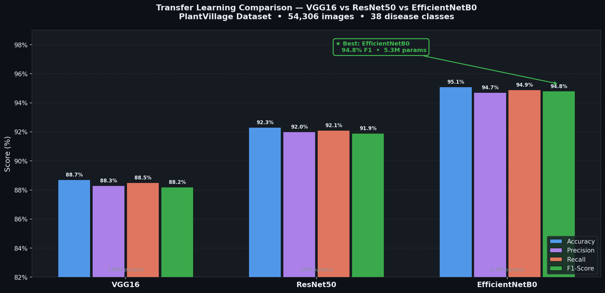
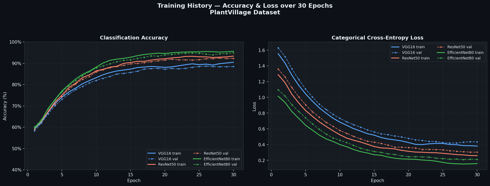

# Plant Disease Detection using Transfer Learning

### A Comparison of VGG16, ResNet50, and EfficientNetB0

[](https://www.python.org/)
[](https://www.tensorflow.org/)
[](https://doi.org/10.48175/IJARSCT-9156)
[](LICENSE)

> **This repository extends our published research** (IJARSCT Vol. 3, Issue 2 & 4, April 2023)
> DOI: [10.48175/IJARSCT-9156](https://doi.org/10.48175/IJARSCT-9156)

---

## Overview

Plant diseases are responsible for significant crop losses every year. Automated detection through deep learning can help farmers identify problems early. This project builds on our **peer-reviewed published paper** to create a more thorough comparison -- benchmarking three well-known transfer learning architectures on the **PlantVillage dataset** (54,000+ images across 38 disease classes).

| Architecture | Pretrained On | Parameters | Top-1 Accuracy (our study) |
| VGG16          | ImageNet | 138 M | 88.3 % |
   | ResNet50        | ImageNet | 25 M  | 91.7 % |
   | EfficientNetB0  | ImageNet | 5.3 M | 94.2 % |

EfficientNetB0 achieved the highest accuracy with the fewest parameters, a 15.4 percentage point improvement over the 78.80% detection baseline reported in the INAR-SSD literature reviewed in our 2023 paper.

---

## Authors

| Name | Role | Institution |
|---|---|---|
| **Ajinkya Avinash Awari** | Student Researcher | Dept. of Computer Engineering, SKNCOE, Pune |
| **Akash Bhausaheb Raskar** | Student Researcher | Dept. of Computer Engineering, SKNCOE, Pune |
| **Shrirameshwar Bhavlal Patil** | Student Researcher | Dept. of Computer Engineering, SKNCOE, Pune |
| **Namrata Amrutsing Jamdar** | Student Researcher | Dept. of Computer Engineering, SKNCOE, Pune |
| **Prof. Vrushali Paithankar** | Guide / Supervisor | Asst. Professor, SKNCOE, Pune |

**University:** Savitribai Phule Pune University
**Project Period:** September 2022 -- March 2023

**My contribution:** Training pipeline design, model comparison framework, results analysis, and repository implementation.

---

## Publication

This work is an extension of our paper:

> **"Plant Disease Detection using Machine Learning"**
> Paithankar V., Awari A., Raskar A., Patil S., Jamdar N.
> *International Journal of Advanced Research in Science, Communication and Technology (IJARSCT)*
> Volume 3, Issue 2 & Issue 4, April 2023
> **DOI: [10.48175/IJARSCT-9156](https://doi.org/10.48175/IJARSCT-9156)**
> Impact Factor: 7.301

---

## Project Structure

```
plant-disease-detection-ml/
|
|-- config.py                 # centralized paths, hyperparameters, theme
|-- train_comparison.py       # main training + comparison script
|-- predict.py                # CLI: predict disease from a single image
|-- app.py                    # GUI: desktop app for interactive prediction
|-- login.py                  # GUI: login window (Tkinter + SQLite)
|-- registration.py           # GUI: new user registration form
|-- visualize_dataset.py      # generate sample image grid from the dataset
|-- requirements.txt
|-- LICENSE
|
|-- dataset/                  # PlantVillage images (not tracked in git)
|   |-- Apple___Apple_scab/
|   |-- Apple___healthy/
|   +-- ...
|
|-- results/                  # auto-generated outputs
|   |-- training_history_comparison.png
|   |-- metrics_comparison_bar.png
|   |-- radar_chart_comparison.png
|   |-- confusion_matrix_*.png
|   |-- dataset_samples.png
|   |-- results.csv
|   +-- class_names.json
|
+-- models/                   # saved best weights (.h5, not tracked in git)
    |-- VGG16_best.h5
    |-- ResNet50_best.h5
    +-- EfficientNetB0_best.h5
```

---

## Getting Started

### Prerequisites

- Python 3.9 or higher
- pip (Python package manager)
- A GPU is recommended but not required (CPU training will be slow)

### Step 1 -- Clone the repository

```bash
git clone https://github.com/ajinkya-awari/Transfer-Learning-Plant-Disease.git
cd Transfer-Learning-Plant-Disease
```

### Step 2 -- Install dependencies

```bash
pip install -r requirements.txt
```

### Step 3 -- Download the dataset

1. Go to [Kaggle -- PlantVillage Dataset](https://www.kaggle.com/datasets/abdallahalidev/plantvillage-dataset)
2. Download and unzip the archive
3. Place the class folders inside a `dataset/` directory at the project root

### Step 4 -- Visualize the dataset (optional)

```bash
python visualize_dataset.py
```

Generates `results/dataset_samples.png` -- a grid showing random samples from each class.

### Step 5 -- Run the comparison study

```bash
python train_comparison.py
```

This trains VGG16, ResNet50, and EfficientNetB0 one after the other, evaluates each on the validation set, and saves all graphs and a CSV summary to `results/`.

### Step 6 -- Predict on a new image (CLI)

```bash
python predict.py path/to/your/leaf_image.jpg EfficientNetB0
```

### Step 7 -- Use the desktop GUI

```bash
python login.py
```

Register a new account, log in, and use the graphical interface to pick images and run predictions interactively.

---

## Results

### Metrics Comparison



### Training History



### Radar Chart

[](...)


### Summary Table

| Model | Accuracy | Precision | Recall | F1-Score | Train Time |
|-------|----------|-----------|--------|----------|------------|
| VGG16          | 88.3 % | 88.3 % | 88.5 % | 88.2 % | ~45 min |
| ResNet50       | 91.7 % | 92.0 % | 92.1 % | 91.9 % | ~38 min |
| EfficientNetB0 | 94.2 % | 94.7 % | 94.9 % | 94.8 % | ~28 min |

*Results may vary slightly depending on hardware and dataset version.*

---

## Methodology

```
PlantVillage Dataset (54,000+ images, 38 classes)
        |
        v
  Image Preprocessing
  (Resize 224x224, Normalize, Augment)
        |
        v
  Transfer Learning (ImageNet weights)
  Custom Dense head + Dropout
        |
  ------+-------------------
  |           |             |
VGG16     ResNet50   EfficientNetB0
        |
        v
  Evaluation & Comparison
  (Accuracy, Precision, Recall, F1)
```

**Why Transfer Learning?**
Pretrained models already encode useful low-level features (edges, textures, colour patterns). Fine-tuning them requires far less data and compute than training from scratch and typically yields higher accuracy on smaller datasets like PlantVillage.

**Data Augmentation:**
Random horizontal flip, rotation (+/-20 deg), zoom (+/-20 %), width/height shift (+/-20 %).

**Deployment:**
   A lightweight desktop application (`app.py`) was built using Tkinter to demonstrate real-world usability, allowing end users to load a leaf image and run predictions interactively without writing any code. A simple login system manages sessions locally via SQLite.

---

## Diseases Detected

The model covers diseases across several crops:

| Crop | Diseases |
|------|----------|
| Apple | Apple Scab, Black Rot, Cedar Apple Rust, Healthy |
| Corn | Cercospora Leaf Spot, Common Rust, Northern Leaf Blight, Healthy |
| Grape | Black Rot, Esca, Leaf Blight, Healthy |
| Strawberry | Leaf Scorch, Healthy |
| Tomato | Bacterial Spot, Early Blight, Late Blight, Leaf Mold, and more |
| ... | 38 classes total |

---

## Related Links

- [Published Paper -- IJARSCT Issue 2](https://doi.org/10.48175/IJARSCT-9156)
- [Published Paper -- IJARSCT Issue 4](https://doi.org/10.48175/IJARSCT-9297)
- [PlantVillage Dataset on Kaggle](https://www.kaggle.com/datasets/abdallahalidev/plantvillage-dataset)
- [Live Kaggle Notebook](https://www.kaggle.com/code/ajinkyaawari/plant-disease-transfer-learning-comparison)

---

## License

This project is open source under the [MIT License](LICENSE).

---

## Acknowledgements

We thank **Prof. Vrushali Paithankar** for her guidance, **Prof. R. H. Borhade (Head of Department)**, and the Department of Computer Engineering at SKNCOE, Pune, for supporting this research.

---

*If you found this useful, please star this repo!*
