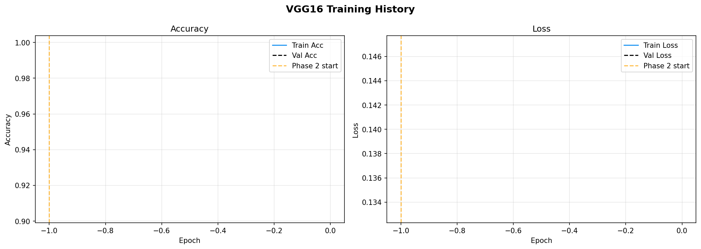
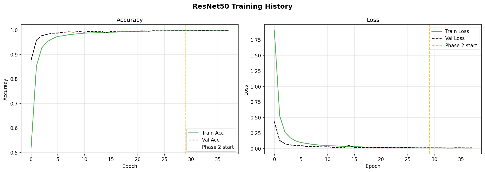
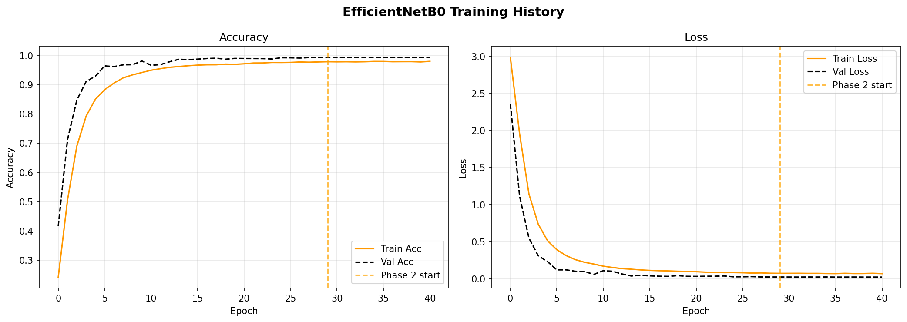
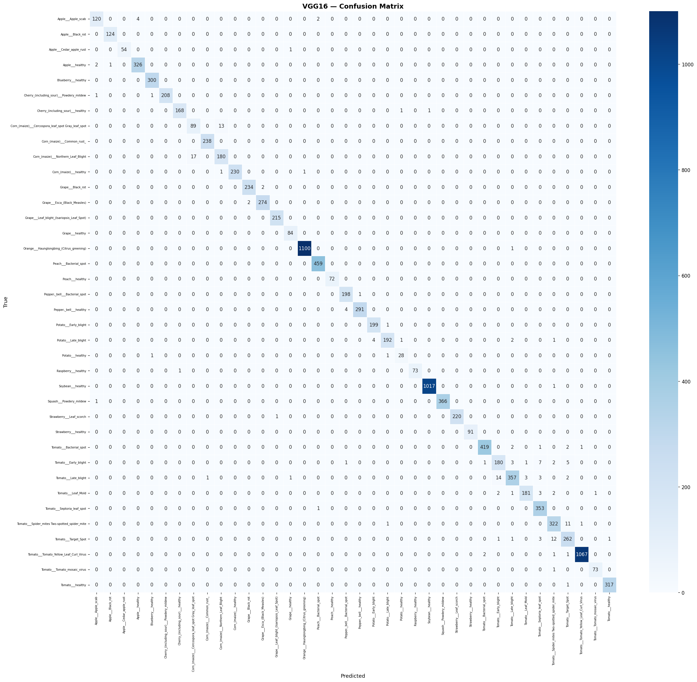

# Plant Disease Detection using Transfer Learning

### A Comparison of VGG16, ResNet50, and EfficientNetB0

[](https://www.python.org/)
[](https://www.tensorflow.org/)
[](https://doi.org/10.48175/IJARSCT-9156)
[](LICENSE)

> **Extension of published research** (IJARSCT Vol. 3, Issue 2 & 4, April 2023)
> DOI: [10.48175/IJARSCT-9156](https://doi.org/10.48175/IJARSCT-9156)

---

## Overview

Plant diseases are responsible for significant crop losses every year. Automated detection through deep learning can help farmers identify problems early. This project is an extension of published research — benchmarking three transfer learning architectures on the **PlantVillage dataset** (54,000+ images across 38 disease classes).

| Architecture | Pretrained On | Parameters | Accuracy (this study) |
|---|---|---|---|
| VGG16 | ImageNet | 138 M | 98.45 % |
| EfficientNetB0 | ImageNet | 5.3 M | 99.30 % |
| **ResNet50** | **ImageNet** | **25 M** | **99.76 %** |

All three models exceed **98% accuracy** using a two-phase transfer learning strategy — significantly outperforming the original CNN from the published paper.

---

## Author

**Ajinkya Avinash Awari**
Dept. of Computer Engineering, SKNCOE, Pune
Savitribai Phule Pune University

---

## Publication

This project extends the following paper:

> **"Plant Disease Detection using Machine Learning"**
> *International Journal of Advanced Research in Science, Communication and Technology (IJARSCT)*
> Volume 3, Issue 2 & Issue 4, April 2023
> **DOI: [10.48175/IJARSCT-9156](https://doi.org/10.48175/IJARSCT-9156)**
> Impact Factor: 7.301

---

## Project Structure

```
Transfer-Learning-Plant-Disease/
|
|-- config.py                 # centralized paths, hyperparameters, theme
|-- train_comparison.py       # main training + comparison script
|-- predict.py                # CLI: predict disease from a single image
|-- app.py                    # GUI: desktop app for interactive prediction
|-- login.py                  # GUI: login window (Tkinter + SQLite)
|-- register.py               # GUI: new user registration form
|-- visualize_dataset.py      # generate sample image grid from the dataset
|-- requirements.txt
|-- LICENSE
|
|-- dataset/                  # PlantVillage images (not tracked in git)
|   |-- Apple___Apple_scab/
|   |-- Apple___healthy/
|   +-- ...
|
|-- results/                  # generated outputs (tracked in git)
|   |-- training_history_comparison.png
|   |-- metrics_comparison_bar.png
|   |-- radar_chart_comparison.png
|   |-- confusion_matrix_VGG16.png
|   |-- confusion_matrix_ResNet50.png
|   |-- confusion_matrix_EfficientNetB0.png
|   |-- VGG16_training_history.png
|   |-- ResNet50_training_history.png
|   |-- EfficientNetB0_training_history.png
|   |-- results_comparison.csv
|   +-- class_names.json
|
+-- models/                   # saved best weights (.h5, not tracked in git)
    |-- VGG16_best.h5
    |-- ResNet50_best.h5
    +-- EfficientNetB0_best.h5
```

---

## Getting Started

### Prerequisites

- Python 3.9 or higher
- pip (Python package manager)
- A GPU is recommended but not required (CPU training will be slow)

### Step 1 -- Clone the repository

```bash
git clone https://github.com/ajinkya-awari/Transfer-Learning-Plant-Disease.git
cd Transfer-Learning-Plant-Disease
```

### Step 2 -- Install dependencies

```bash
pip install -r requirements.txt
```

### Step 3 -- Download the dataset

1. Go to [Kaggle -- PlantVillage Dataset](https://www.kaggle.com/datasets/abdallahalidev/plantvillage-dataset)
2. Download and unzip the archive
3. Place the class folders inside a `dataset/` directory at the project root

### Step 4 -- Visualize the dataset (optional)

```bash
python visualize_dataset.py
```

Generates `results/dataset_samples.png` — a grid showing random samples from each class.

### Step 5 -- Train all models

```bash
python train_comparison.py
```

Trains VGG16, ResNet50, and EfficientNetB0 sequentially using two-phase transfer learning, evaluates each on the validation set, and saves all graphs and a CSV summary to `results/`.

### Step 6 -- Predict on a new image (CLI)

```bash
python predict.py path/to/your/leaf_image.jpg ResNet50
```

### Step 7 -- Use the desktop GUI

```bash
python login.py
```

Register a new account, log in, and use the graphical interface to pick images and run predictions interactively.

---

## Results

### Summary Table

| Model | Accuracy | Precision | Recall | F1-Score |
|-------|----------|-----------|--------|----------|
| VGG16 | 98.45 % | 98.46 % | 98.45 % | 98.45 % |
| EfficientNetB0 | 99.30 % | 99.31 % | 99.30 % | 99.30 % |
| **ResNet50** | **99.76 %** | **99.76 %** | **99.76 %** | **99.76 %** |

*Trained on PlantVillage dataset — 43,456 train / 10,849 validation images, 38 classes, GPU T4 x2.*

### Metrics Comparison


### Radar Chart


### Training History — All Models


### Per-Model Training History







### Confusion Matrices




---

## Methodology

```
PlantVillage Dataset (54,000+ images, 38 classes)
        |
        v
  Image Preprocessing
  (Resize 224x224, Normalize, Augment)
        |
        v
  Phase 1: Transfer Learning (ImageNet weights)
  Full model trainable, LR = 1e-5, 30 epochs
        |
        v
  Phase 2: Fine-tuning
  LR = 1e-6, 20 epochs
        |
  ------+-------------------
  |           |             |
VGG16     ResNet50   EfficientNetB0
        |
        v
  Evaluation & Comparison
  (Accuracy, Precision, Recall, F1)
```

**Why Transfer Learning?**
Pretrained models already encode useful low-level features (edges, textures, colour patterns). Fine-tuning them requires far less data and compute than training from scratch and typically yields higher accuracy on smaller datasets like PlantVillage.

**Data Augmentation:**
Random horizontal flip, rotation (±30°), zoom (±30%), width/height shift (±30%), brightness range [0.8, 1.2].

---

## Diseases Detected

| Crop | Diseases |
|------|----------|
| Apple | Apple Scab, Black Rot, Cedar Apple Rust, Healthy |
| Corn | Cercospora Leaf Spot, Common Rust, Northern Leaf Blight, Healthy |
| Grape | Black Rot, Esca, Leaf Blight, Healthy |
| Strawberry | Leaf Scorch, Healthy |
| Tomato | Bacterial Spot, Early Blight, Late Blight, Leaf Mold, and more |
| ... | 38 classes total |

---

## Related Links

- [Published Paper -- IJARSCT Issue 2](https://doi.org/10.48175/IJARSCT-9156)
- [Published Paper -- IJARSCT Issue 4](https://doi.org/10.48175/IJARSCT-9297)
- [PlantVillage Dataset on Kaggle](https://www.kaggle.com/datasets/abdallahalidev/plantvillage-dataset)
- [SKNCOE -- Smt. Kashibai Navale College of Engineering](https://www.sinhgad.edu/)

---

## License

This project is open source under the [MIT License](LICENSE).

---

## Acknowledgements

Special thanks to **Prof. Vrushali Paithankar** for guidance and the Department of Computer Engineering at SKNCOE, Pune for supporting this research.

---

*If you found this useful, please star this repo!*
